# `Chatter`
Web application for instant messaging. Deployed to Heroku: https://chatter-messaging-app.herokuapp.com

## Technologies and libraries used: 

 - Server - [Node](https://nodejs.org/), [Express](https://expressjs.com)
 - WebSocket - [socket.io](https://socket.io)
 - Authentication - [JSON Web Token](https://jwt.io), [Google Auth](https://developers.google.com/identity/sign-in/web/sign-in)
 - Database - [MongoDB](https://www.mongodb.com), connected via [mongoose](https://mongoosejs.com)
 - Client Framework - [React](https://reactjs.org), [Redux Toolkit](https://redux-toolkit.js.org)
 - Styles - [Tailwind CSS](https://tailwindcss.com) 
 - Testing - [Jest](https://jestjs.io), [React Testing Library](https://testing-library.com)
 - Toast messages - [React-Toastify](https://www.npmjs.com/package/react-toastify)
 - Emoji - [React Emoji Picker](https://www.npmjs.com/package/emoji-picker-react)

## Limitations: 
- Messages are currently stored on the client side with the limit of 15 messages per channel. The client store is cleaned up each time the page is refreshed. 
- Messages are not stored on the server or database.

## Planned Improvements:
- Get user images from Google Account.
- Update channel details.
- Close channel panel once selected.
- Show online users.

## GIFs:

## Screenshots:

### Desktop (macOS, Chrome):

  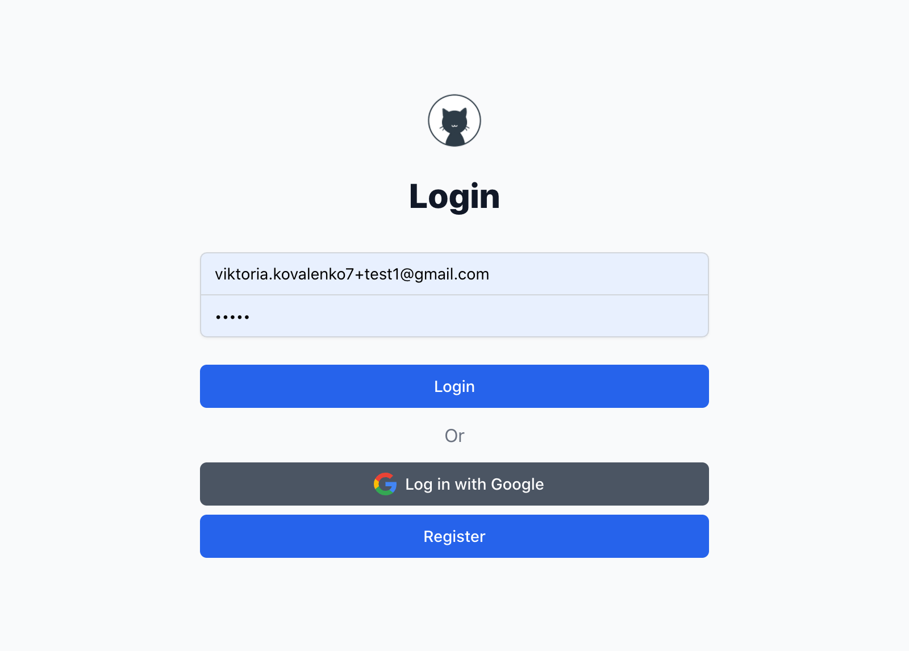
  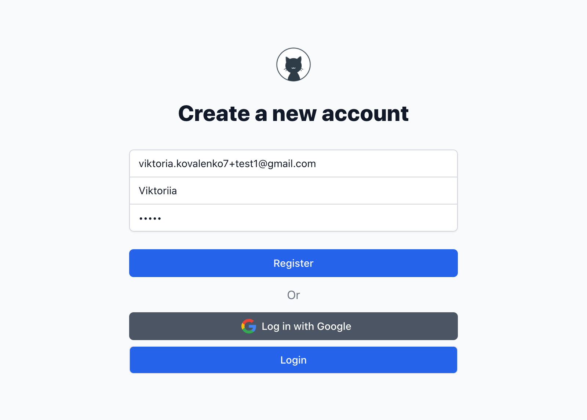 

  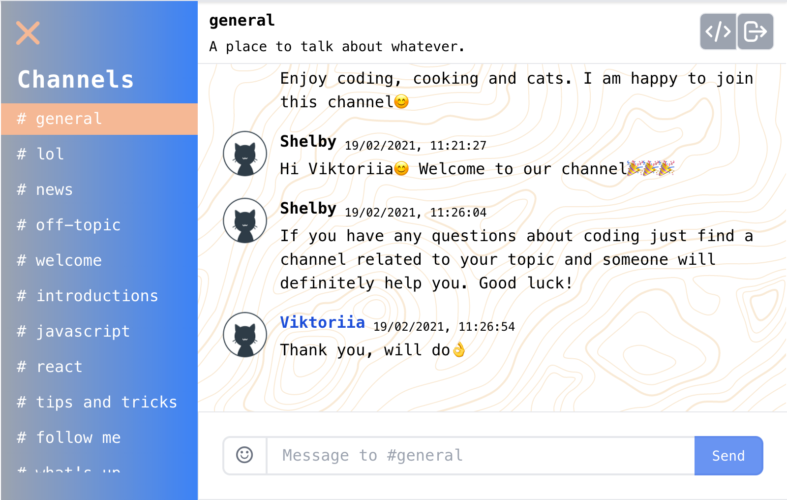
  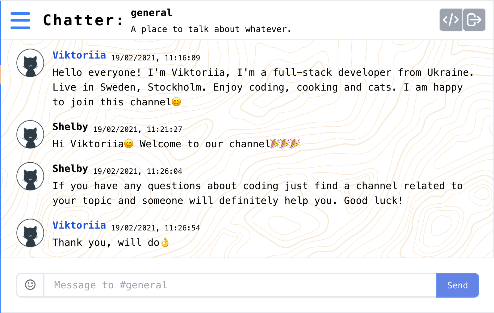

  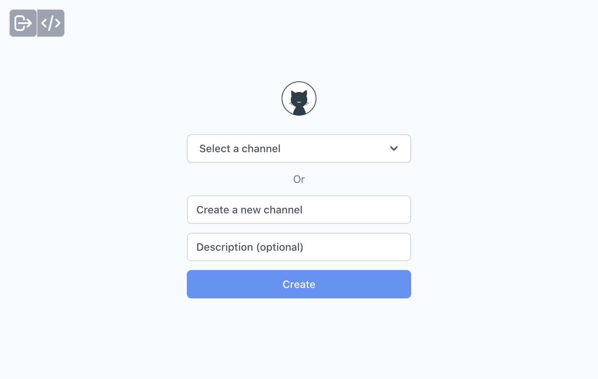
  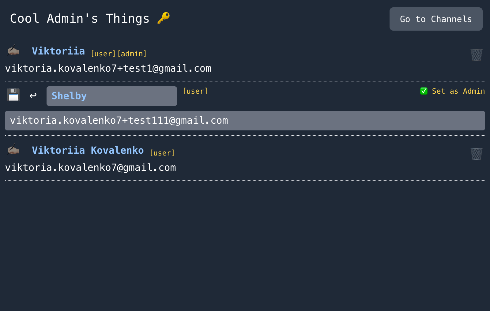

  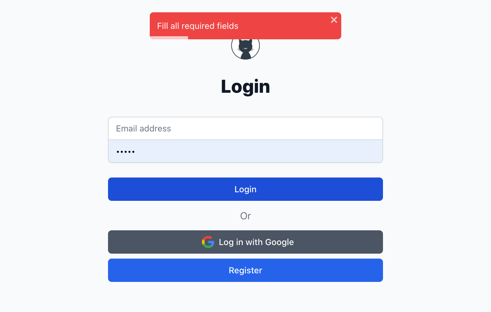
  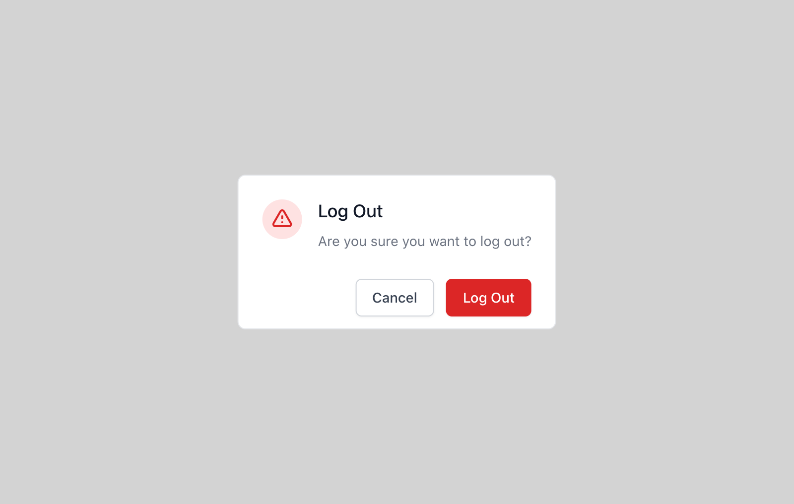

### Mobile (iOS, Chrome):

  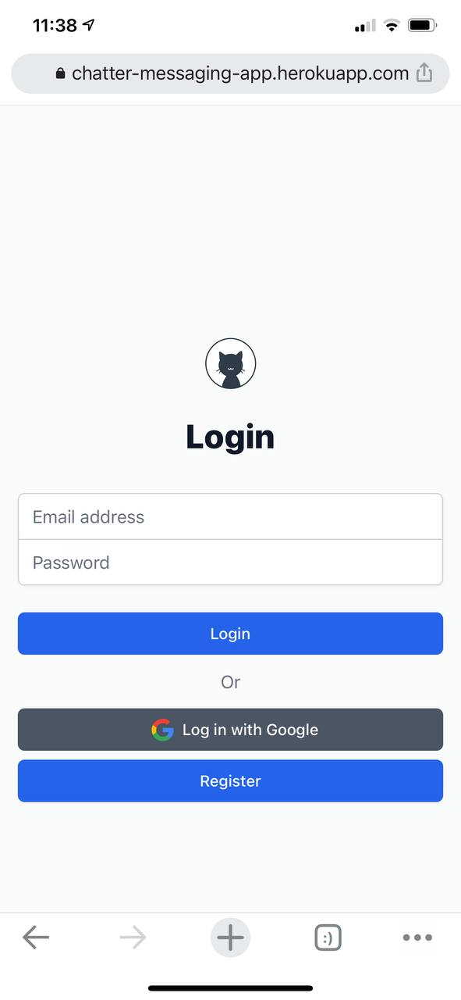
  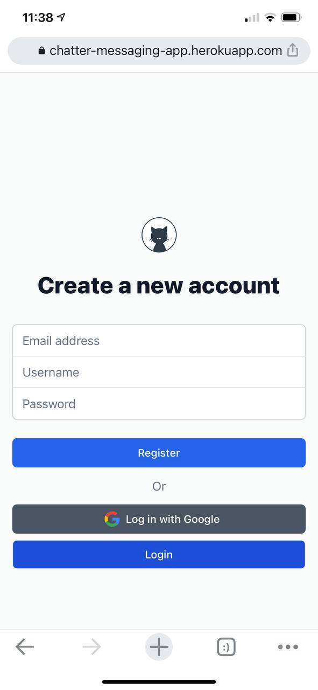 
  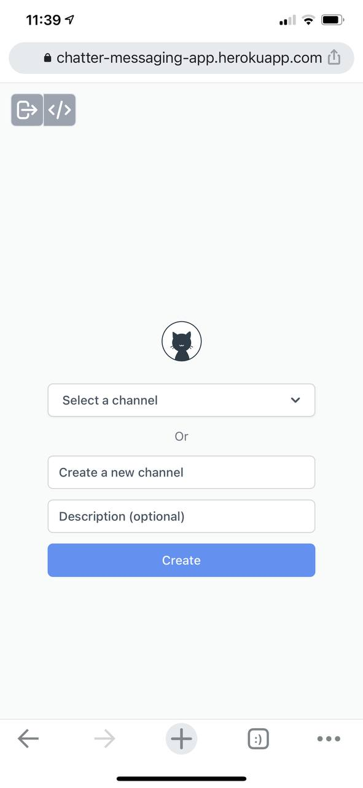 

  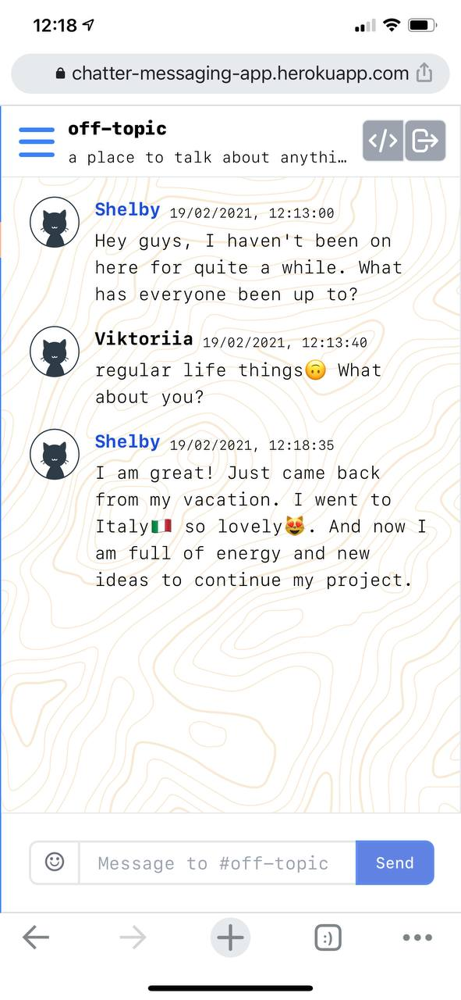
  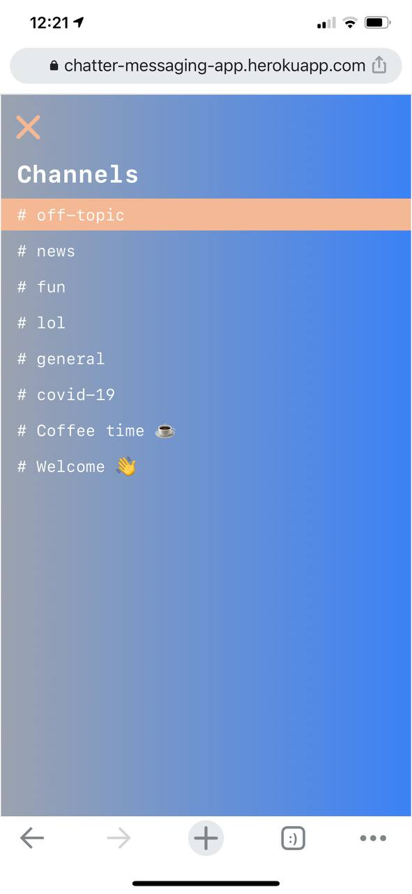
  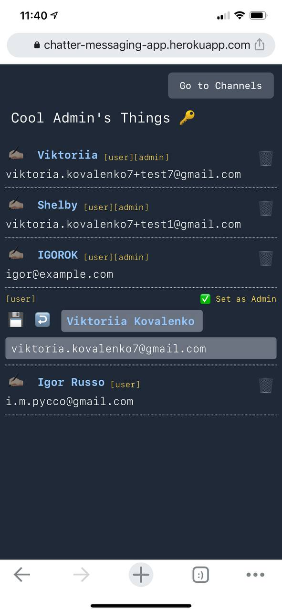

  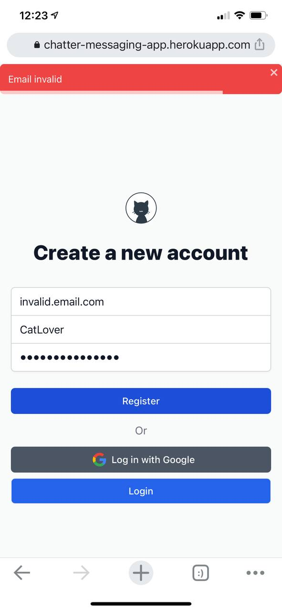
  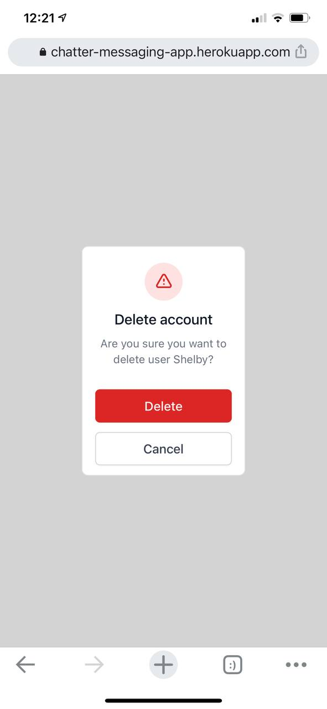

  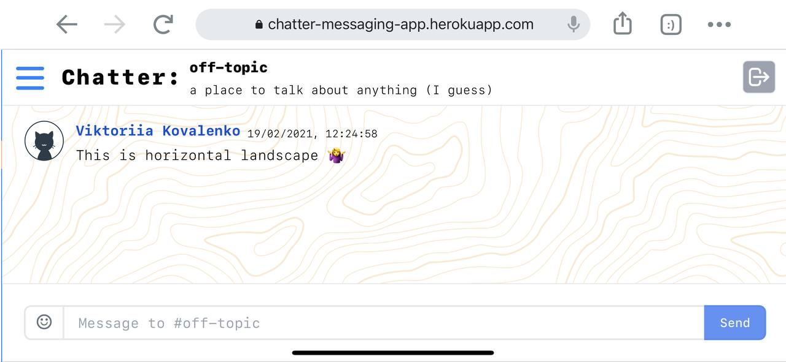

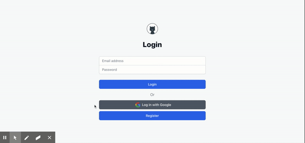

